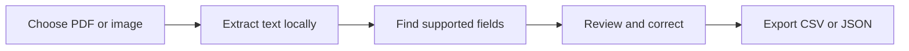

# LocalLens

**Privacy-first, local document parsing prototype** for the HackFusion software-domain hackathon.

> Team: ContructX,Member Name:Saividhatri Aluguri 
> Round: 2 progress checkpoint  
> Status: Working prototype; accuracy and offline behavior still need systematic evaluation.

## Problem

Copying selected details from forms and other documents by hand takes time and can lead to mistakes. Sending sensitive files to online services may also raise privacy concerns.

## Proposed solution

LocalLens is a local web app that reads text from PDFs and images, finds a small set of common fields, and lets a person review and edit the results before exporting them. The app is intended to run on the user's computer; it does not call a cloud OCR or AI service.

## Current features

- Guided three-screen workflow: upload, review, and export.
- Extract text from digital PDFs and scanned PDF pages using local OCR.
- Read text from image files with locally installed Tesseract OCR.
- Find common fields: name, email, phone, date, and ID number.
- Show a document preview and the extracted text, with matched values highlighted where possible.
- Highlight detected values in the document preview.
- Let the user correct extracted values and inspect nearby source text.
- Show review labels based on whether the edited value appears in the extracted source text and passes a basic format check. These are evidence hints, not OCR accuracy scores.
- Warn when common fields are missing, explain common read errors, and offer a quick way to start over.
- Export reviewed fields as CSV or JSON.
- Optionally create a flattened copy with selected fields permanently covered.
- Show where processing happens and how long the uploaded document remains in the active app session; clear it with the finish button or start over.

## Technology stack

- Python
- Streamlit for the local web interface
- PyMuPDF for PDF text extraction and preview
- Tesseract OCR with pytesseract for image text recognition
- Pillow for image handling

## How it works



## Run on Windows

1. Install Python 3.10 or newer.
2. For image OCR and scanned PDF pages, install Tesseract for Windows and include English language data. Text-based PDFs do not need Tesseract.
3. Open PowerShell in the LocalLens folder.
4. Create and activate a virtual environment:

   ```powershell
   py -m venv .venv
   .\.venv\Scripts\Activate.ps1
   ```

5. Install the Python packages and start LocalLens:

   ```powershell
   pip install -r requirements.txt
   streamlit run app.py
   ```

6. Open the local address printed in PowerShell, usually `http://localhost:8501`.

## Run the smoke tests

From the project folder, with the virtual environment active, run:

```powershell
py -m unittest -v test_locallens_core
```

The tests cover text-based and scanned PDF extraction, OCR-style line breaks, missing fields, CSV export, image highlights, and redaction of synthetic image/PDF samples. OCR-dependent tests are skipped if local Tesseract is unavailable.

## Demo

Use the included fictional sample image, `locallens_sample_form.png`, or another synthetic or consented sample. Upload it, review the extracted values against the preview, edit any mistakes, and download CSV or JSON.

## Privacy and limitations

The prototype performs PDF extraction and OCR locally and does not intentionally send document content to a cloud OCR or AI service. Redacted downloads are flattened image-based copies; the original is unchanged. Check the downloaded copy visually before sharing it. Before describing offline operation as verified, test with the internet disconnected and review the installed dependencies. OCR and simple text patterns can make mistakes; users should verify every value. The first version supports a limited set of fields and layouts and is not intended to make decisions about people.

## Evaluation planned for the checkpoint

- Try synthetic samples with different layouts and image quality.
- Compare extracted fields with manually checked values.
- Record which fields are missed or misread and improve the supported patterns.
- Demonstrate local processing and verify offline behavior before making that claim.

Do not report accuracy numbers until the team has measured them on a documented sample set.
